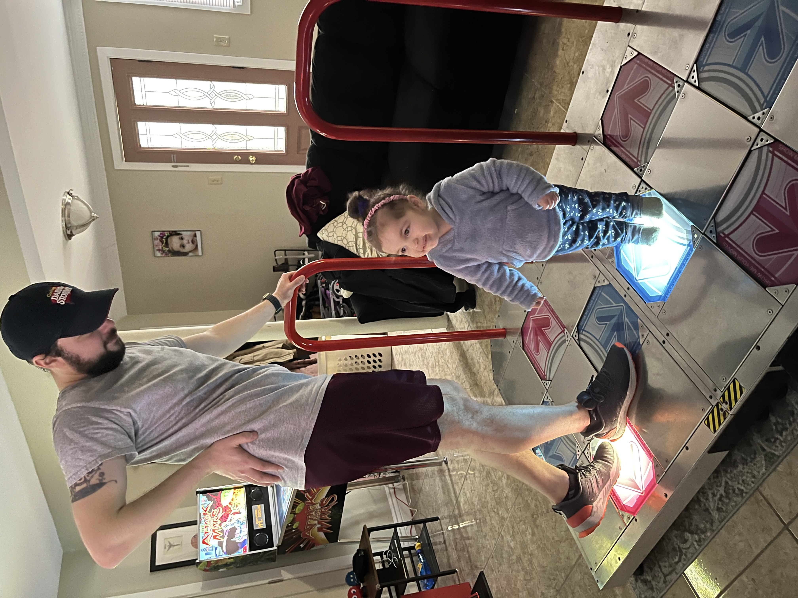

# Hello, I'm Dean 👋  
This is where I save personal code and learn from other much better programmers than myself.
This GitHub profile and the repos contained within are all part of my 'best I can do right now' package and are reflections of the best I could do at the time.  
The bar will continue to be raised because excellence is constantly being redefined and there's way too much knowledge to obtain in a single human lifetime 😵

## About Me
- 🫠 Just a dude doing stuff and things
- 💿 A professional Endpoint Engineer primarily scripting in a hybrid Azure Windows enterprise environment
- 🌱 Currently learning JavaScript for interacting with the web and interfacing with AI systems
- 🚶🏻 Love exercising (primarily walking and Dance Dance Revolution)
- 🧑🏻‍🏭 You can also find me on [LinkedIn](https://www.linkedin.com/in/dean-tammam-15b4775a/)

## Personal Interests
- 📈 Personal Development: Love learning and improving, it's the most fun part of most things I find myself doing
- ⚙️ Systemization: Naturally try to systemize most things (the idea of putting code into functions makes my soul happy)
- 🧠 Artificial Intelligence: Have been following contemporary AI closely, love ChatGPT and the OpenAI API
- 🧑🏻‍💻 Technology at large: Get a lot of satisfaction and have fun playing with tech
- 👀 YouTube: Consume the majority of content there (classes, conversations, music, silly things)

## Recent Projects
- [ddr-picker ⬅️⬇️⬆️➡️](https://github.com/dtammam/ddr-picker): A Dance Dance Revolution front-end interface for selecting multiple games
- [Mothership on Main 🛸](https://github.com/dtammam/Mothership-on-Main): A browser extension that allows for an optimized custom homepage
- [PowerShell Learnings 📖](https://github.com/dtammam/PowerShell-Scripts): A repo of random and ongoing learnings with PowerShell

## Visual Representation
  

Thanks for reading 🙂
